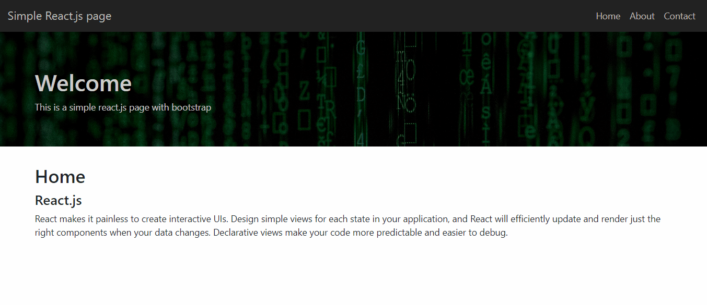

# 
React-My-Projects

 

## 🔍 About

This is a repository with some of my projects on REACT I hope you enjoy and fell free to use if you want!

 

## 🚀 The Projects

 

### 💻 CRUD made with React(frontEnd) and JsonServer(backEnd). <a href="https://github.com/gustavobacellarladeira/React.js-My-Projects/tree/master/Crud-Only-React-with-jsonServer">Go to the project !</a>

 
 

 
 

 
 

### 💻 A page made on React.js. <a href="https://github.com/gustavobacellarladeira/React.js-My-Projects/tree/master/React.js-Page-Made-On-React">Go to the project !</a>

 
 

 
 

 
 

### 💻 One of the first app that I made. <a href="https://github.com/gustavobacellarladeira/React.js-My-Projects/tree/master/React.js-Simple-Page-Aplication">Go to the project !</a>

 
 

 
 

 
 

## ✨ Technologies used on this projects

 

<ul>
    <li> React
    <li> Styled-components
    <li> Html / Css
    <li> Rest api
   
</ul>

 

 

 
Made with ♥ by Gustavo Bacellar 👋 <a href="https://www.linkedin.com/in/gustavo-bacellar/?msgControlName=reply_to_sender&msgConversationId=6714883939833561088&msgOverlay=true">Get in touch!</a>
