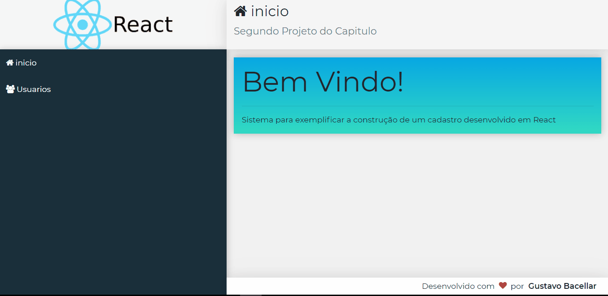

#  
 React.js  CRUD Page 
 

 

## 🔍 About

 

This is not a big project but it's important becose this project make me learn de basics and fall in love with react.js 

 

## ✨ Technologies used on this project

<ul>
    <li> React.js
    <li> React-router-dom
    <li> json-server
    <li> axios
    <li> bootstrap
    <li> font-awesome
    <li> Html / Css
</ul>
 
 
 

<!-- 📝 License

This project is under the MIT license. See the LICENSE for more information -->

 
Made with ♥ by Gustavo Bacellar 👋 <a href="https://www.linkedin.com/in/gustavo-bacellar/?msgControlName=reply_to_sender&msgConversationId=6714883939833561088&msgOverlay=true">Get in touch!</a>