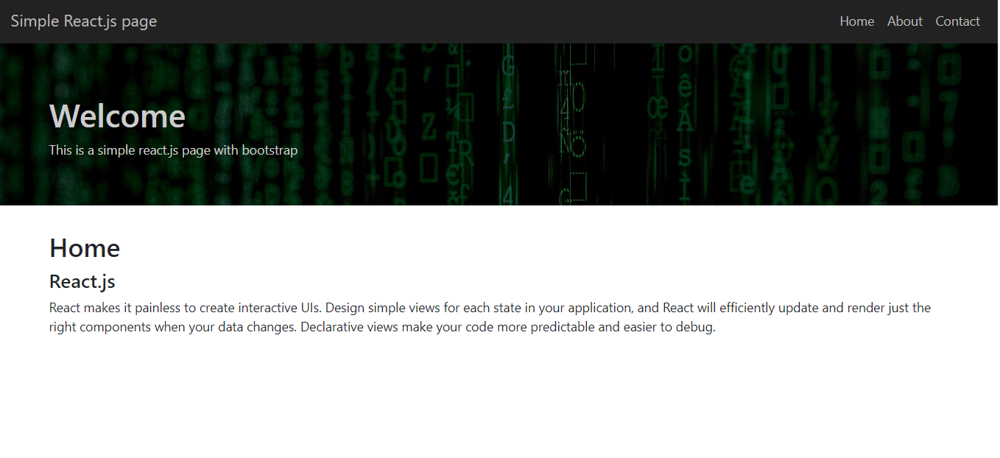

#  
 Simple React.js  and Bootstrap  Page 
 

<h3>About</h3>

This is not a big project but it's important becose this project make me learn de basics and fall in love with react.js 

 

<h4> 🚀 Technologies</h4>

<ul>
    <li> React.js
    <li> React-router-dom
    <li> React-bootstrap
    <li> Styled-components
    <li> Html / Css
</ul>

<!-- 📝 License

This project is under the MIT license. See the LICENSE for more information -->

Made with ♥ by Gustavo Bacellar 👋 <a href="https://www.linkedin.com/in/gustavo-bacellar/?msgControlName=reply_to_sender&msgConversationId=6714883939833561088&msgOverlay=true">Get in touch!</a>